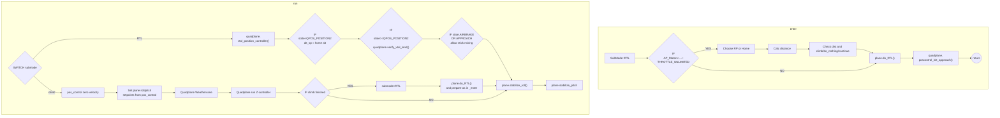

```mermaid
flowchart TD
    subgraph enter
    s1[SubMode::RTL] --> s2{"IF
    AP_Motors::...::
    THROTTLE_UNLIMITED"}
    s2 -->|YES| s3[Choose RP or Home]
    s3 --> s4[Calc distance]
    s4 --> s5[Check dist and climb/do_nothing/continue]
    s5 --> s6["plane.do_RTL()"]
    s2 -->|NO| s6
    s6 --> s7["quadplane.
        poscontrol_init_approach()"]
    s7 --> s8((return))
    end

    subgraph run
    s9{SWITCH submode} -->|climb| s10["pos_control zero velocity"]
    s10 --> s11["Set plane roll/pitch
        setpoints from pos_control"]
    s11 --> s12["Quadplane Weathervane"]
    s12 --> s13["Quadplane run Z-controller"]
    s13 --> s14{"IF climb finished"}
    s14 -->|YES| s15[submode=RTL]
    s15 --> s16["plane.do_RTL()
        and prepare as in _enter"]
    s9 -->|RTL| s17["quadplane.
        vtol_position_controller()"]
    s17 --> s18{"IF
        state>QPOS_POSITION2
        alt_sp = home alt"}
    s18 --> s19{"IF
        state>=QPOS_POSITION2
        quadplane.verify_vtol_land()"}
    s19 --> s20{"IF state AIRBRAKE
        OR APPROACH
        allow stick mixing"}
    s20 --> s21["plane.stabilize_roll()"]
    s21 --> s22["plane.stabilize_pitch"]
    s16 --> s21
    s14 -->|NO| s21
    end
```
