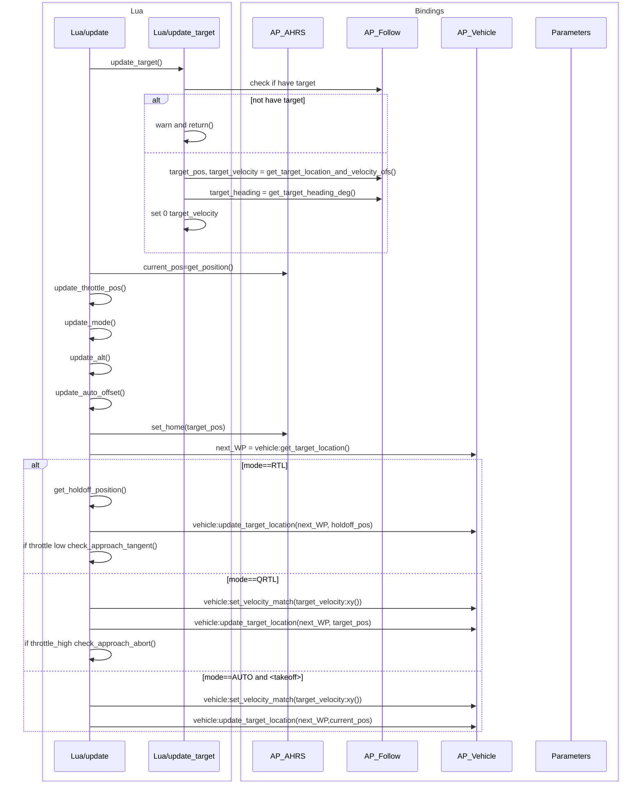

```mermaid
sequenceDiagram
    box Lua
        participant Lua/update
        participant Lua/update_target
    end
    box Bindings
        Participant AP_AHRS
        Participant AP_Follow
        participant AP_Vehicle
        participant Parameters
    end

    Lua/update->>Lua/update_target: update_target()
    Lua/update_target->>AP_Follow: check if have target
    alt not have target
        Lua/update_target->>Lua/update_target: warn and return()
    else
        Lua/update_target->>AP_Follow: target_pos, target_velocity = get_target_location_and_velocity_ofs()
        Lua/update_target->>AP_Follow: target_heading = get_target_heading_deg()
        Lua/update_target->>Lua/update_target: set 0 target_velocity
    end

    Lua/update->>AP_AHRS: current_pos=get_position()

    Lua/update->>Lua/update: update_throttle_pos()
    Lua/update->>Lua/update: update_mode()
    Lua/update->>Lua/update: update_alt()
    Lua/update->>Lua/update: update_auto_offset()
    Lua/update->>AP_AHRS: set_home(target_pos)
    Lua/update->>AP_Vehicle: next_WP = vehicle:get_target_location()

    alt mode==RTL
        # means landing_stage = STAGE_HOLDOFF
        Lua/update->>Lua/update: get_holdoff_position()
        Lua/update->>AP_Vehicle: vehicle:update_target_location(next_WP, holdoff_pos)
        Lua/update->>Lua/update: if throttle low check_approach_tangent()
    else mode==QRTL
        # This mode basically handles the meat of the approach.
        Lua/update->>AP_Vehicle: vehicle:set_velocity_match(target_velocity:xy())
        Lua/update->>AP_Vehicle: vehicle:update_target_location(next_WP, target_pos)
        Lua/update->>Lua/update: if throttle_high check_approach_abort()
    else mode==AUTO and <takeoff>
        # means landing_stage = STAGE_IDLE
        Lua/update->>AP_Vehicle: vehicle:set_velocity_match(target_velocity:xy())
        Lua/update->>AP_Vehicle: vehicle:update_target_location(next_WP,current_pos) # With alt that of next_WP
    end
```
